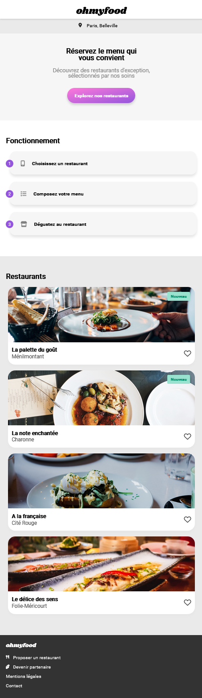

## Ohmyfood! – third project of the OpenClassrooms web-developer path

## Table of Contents
1. [General Info](#general-info)
2. [Technologies](#technologies)

### General Info
***

Ohmyfood! is an online meal ordering company. Our concept allows users to compose their own menu and reduce their waiting time in restaurants because their menu is prepared in advance.

The main goal of this project website is to master Scss and BEM, as well as CSS animations and transitions.

Checkout here for more details about the technical specifications: 
* [technical_sepcifications]( /specificationsTechniques_maquettes/DW-P3-Brief-creatif-Ohmyfood!.pdf)

and mockups of this project :
* [mockup_Acceuil]( specificationsTechniques_maquettes/Accueil.png)
* [mockup_ALaFrançaise]( specificationsTechniques_maquettes/Menu-Alafrancaise.png)
* [mockup_LaNoteEnchantée]( specificationsTechniques_maquettes/Menu-lanoteenchantee.png)
* [mockup_LaPaletteDuGou]( specificationsTechniques_maquettes/Menu-Lapalettedugou.png)
* [mockup_LeDeliceDesSens]( specificationsTechniques_maquettes\Menu-Ledelicedessens.png)

Checkout the URL to take a look : https://lmleopold.github.io/Ohmyfood/
### Screenshot

## Technologies
***
A list of technologies used within the project:
*  
* 
* 

Prohibited: JavaScript, CSS online
